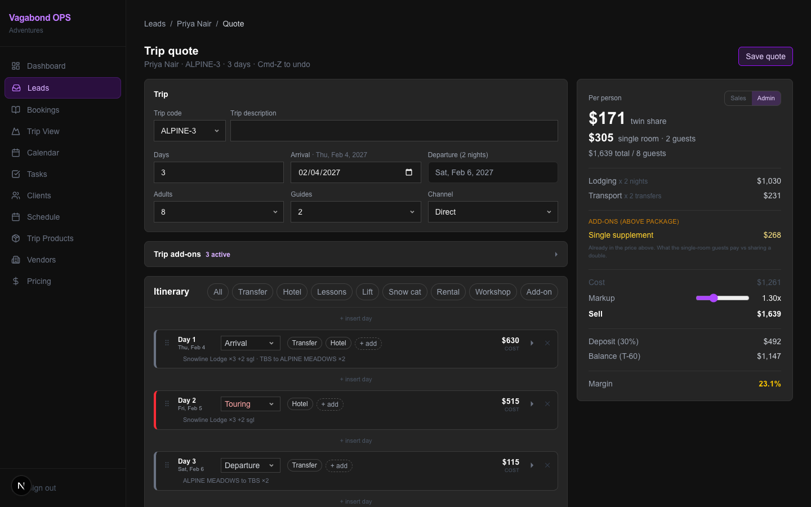
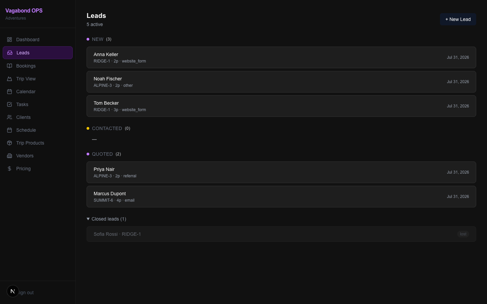
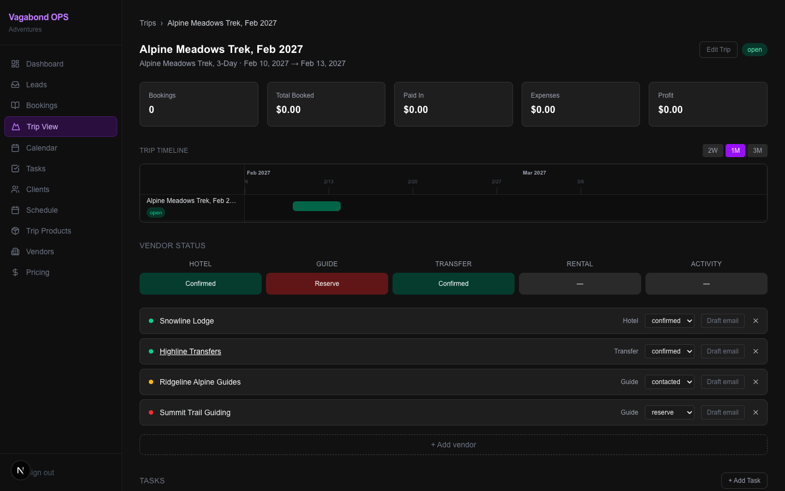
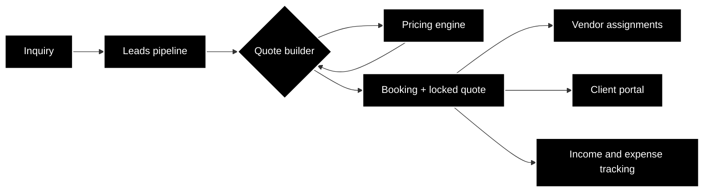

# Vagabond OPS

Operations software for [Vagabond Adventures](https://vagabondadventures.ge), my adventure tour company in Georgia (the country). We run cat skiing, backcountry tours, and summer trips, and the whole operation used to live in spreadsheets, chat threads, and people's heads. This app replaces that.

The code is private because it runs the live business. This repo is the build log: what it does, how it's put together, and where it's headed. Updated as the project moves.

*All screenshots show demo data, never client data.*

## What it does

- **CRM and leads pipeline.** Every inquiry moves through a 7-status pipeline from first contact to booked, with a filterable leads table and one-click conversion from lead to booking that locks the quote snapshot at the moment of conversion.
- **Pricing engine and quote builder.** Tour pricing in this business is genuinely hairy: seasonal rates, group sizes, guide certifications, vendor day rates, accommodation tiers. The engine builds it up from cost layers so a salesperson gets one number they can trust, and margins stay visible to admins only.
- **Vendor coordination.** Assigning guides, drivers, and accommodation to trips, with role-appropriate redaction so vendors see what they need and nothing else.
- **Income and expense tracking** per trip and per season.
- **Client portal** for trip details and documents.

## How it's built

Next.js, React, TypeScript, Supabase (Postgres with row-level security on every table). Around 40 tables, 169 automated tests, and a standing security audit habit: RLS policies, auth flows, and data redaction get reviewed as features, not afterthoughts.

## How it was built

I direct AI to write the code. I own the domain model, the data, the priorities, and whether it actually works for the people using it. Every risky change (migrations, auth, pricing, redaction) goes through an independent AI review gate in a fresh context before merge, because the reviewer that watched the code get written is the reviewer that misses things.

The interesting part of this project was never the code. It was turning ten years of "how we do things" into data structures that a seasonal team can operate without me in the room.

## Build log

- **2026-07**: Leads module built: 7-status pipeline, filterable leads table, lead-to-booking conversion with locked quote snapshots. Next up: confirmation workflows and the lead detail page.
- **2026-07**: Pricing engine rebuilt on versioned rate books, with guide-type rates and role-based redaction for the sales view. 169 tests passing.
- **2026-06 and earlier**: Core CRM, vendor assignments, expense tracking, client portal, and a full defensive security audit (row-level security on every table).
