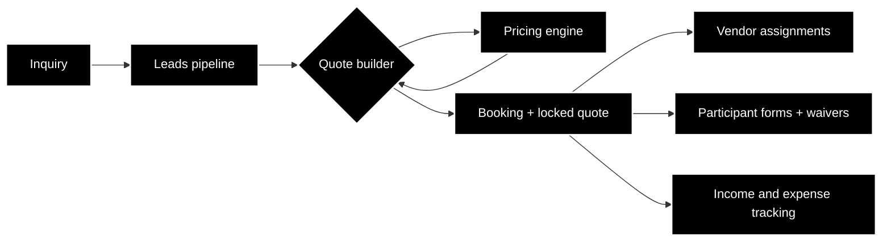

# Vagabond OPS

Operations software for [Vagabond Adventures](https://vagabondadventures.ge), my adventure tour company in Georgia (the country). We run cat skiing, backcountry tours, and summer trips. The operation used to live in spreadsheets and people's heads, then in Zoho One. This app replaces both. Purpose-built for what a tour operator actually needs, no per-user subscription fees, and no commission taken on bookings the way the booking platforms take one.

The code is private because it runs the live business. This repo is the build log. What it does, how it's put together, and where it's headed. Updated as the project moves.

*All screenshots show demo data, never client data.*

## What it does

- **CRM and leads pipeline.** Every inquiry moves through a 7-status pipeline, from first contact to booked or lost, with a filterable leads table and one-click conversion from lead to booking that locks the quote snapshot at the moment of conversion.
- **Pricing engine and quote builder.** Tour pricing in this business is genuinely hairy. Seasonal rates, group sizes, guide certifications, vendor day rates, accommodation tiers, reclaimable VAT, multi-day discounts. The engine resolves every vendor rate against the right season and period, then builds the trip up day by day across nine kinds of line item, including working out the cheapest combination of a hotel's rooms that fits the group. A salesperson gets one number they can trust.
- **Cost and margin redaction.** Sales and ops staff see sell prices. What we pay each vendor, and the margin on top, is admin only and enforced in the database rather than hidden in the interface.
- **Vendor coordination.** Assigning guides, drivers and accommodation to trips, and seeing at a glance which reservations are still unconfirmed.
- **Income and expense tracking** per trip.
- **Participant forms and waivers.** A participant gets a link, reads the real waiver text, signs it, and their client record is created or updated from what they filled in. No account, no password.
- **Embeddable lead form** that can be published on the company site or handed to a partner, dropping straight into the leads pipeline.

## How it's built

Next.js 16, React 19, TypeScript, Supabase. Postgres with row-level security on **every one of the 66 tables**, no exceptions, and **4,203 automated tests**, both measured on `main` on 2026-09-03. A standing security audit habit sits underneath all of it. Row-level security policies, auth flows and data redaction get reviewed as features, not as afterthoughts.

## How it was built

I direct AI to write the code. I own the domain model, the data, the priorities, and whether it actually works for the people using it. Every risky change, meaning migrations, auth, pricing or redaction, goes through an independent AI review gate in a fresh context before it merges, because the reviewer that watched the code get written is the reviewer that misses things.

The interesting part of this project was never the code. It was turning ten years of "how we do things" into data structures that a seasonal team can operate without me in the room.

## Roadmap

Trip PDF generation, and a season-level view of income and expenses across trips rather than per trip.

## Build log

790 commits on `main` since 1 July 2026. August was the biggest month at 492.

- **2026-09.** Vendor invoice PDF attachments, visible to admins only. Database permission hardening, closing a gap where a newly created table could inherit broader public access than intended.
- **2026-08.** Participant e-signature and waiver flow shipped, with a client record created or updated from the signature. Reclaimable VAT applied consistently across every cost line, where some lines had been missed. Server-enforced discounts in the quote builder. An extras engine for single supplements, add-on slots and extra nights. A pricing-accuracy pass that caught and fixed an error overstating one price by 75%, and retired the last legacy pricing table.
- **2026-08.** Leads module went live, and a Trip Products builder shipped so an itinerary is built once and then generates client quotes. Public embeddable lead form.
- **2026-07.** Cheapest-combination room allocation, so the system works out which hotel rooms fit a group instead of staff doing that arithmetic by hand. Trips now declare their own vendors and per-day services. Hourly-billed services bill real hours.
- **2026-06 and earlier.** Core CRM, vendor assignments, expense tracking, and a full defensive security audit.
